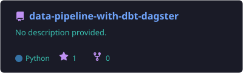
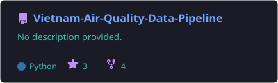
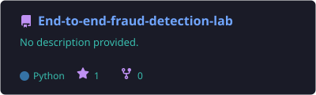
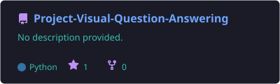
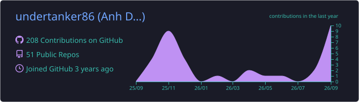
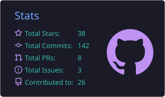
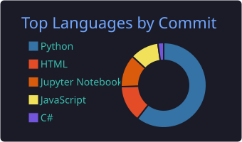

  
  
  
  

## 🧑‍💻 About Me

- 🎓 Final-year undergraduate at **University of Greenwich (Vietnam)**
- 👁️ Working on **Computer Vision** and **Large Language Models** research with deep learning
- ⚙️ Building end-to-end ML systems: training, serving, monitoring, and CI/CD
- 🗄️ Designing data pipelines (ETL/ELT, orchestration with Dagster)
- 🏠 Running a personal Kubernetes homelab for self-hosting and MLOps experiments
- 📫 Reach me at **duongthagch220838@fpt.edu.vn**

## 🛠️ Tech Stack

   
   
  

  
  
  
  

## 🔥 Featured Projects

  
  
   
  
  
   
  

## 📊 GitHub Stats

  

  
  

  

## 🐍 Contribution Activity

<picture>
  <source media="(prefers-color-scheme: dark)" srcset="https://raw.githubusercontent.com/undertanker86/undertanker86/output/github-contribution-grid-snake-dark.svg" />
  
</picture>

---

  ⭐ Thanks for visiting! Feel free to explore my repositories.

